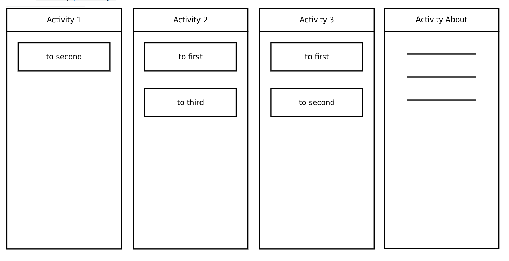
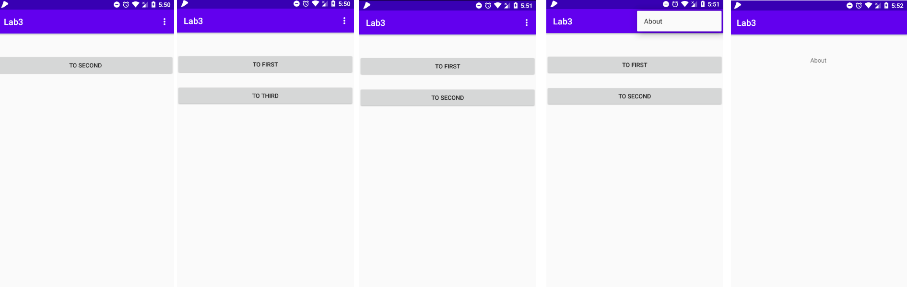
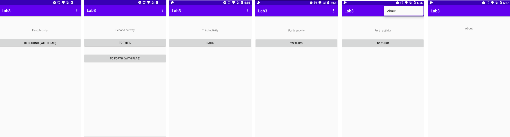
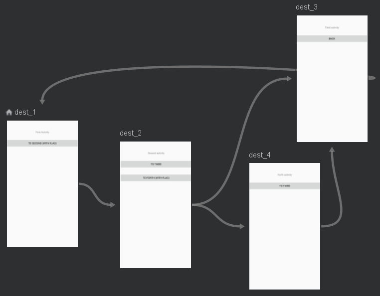

# Лабораторная работа №3. Lifecycle компоненты. Навигация в приложении.
## Цели
  - Ознакомиться с методом обработки жизненного цикла activity/fragment при помощи Lifecycle-Aware компонентов
  - Изучить основные возможности навигации внутри приложения: создание новых activity, navigation graph
## Программа работы
#### Задача 1. Обработка жизненного цикла с помощью Lifecycle-Aware компонентов
В ходе выполнения заданий Codelabs было рассмотрено применение компонентов архитектуры ViewModel, LiveData, а так же LifecycleOwner. Первые 2 шага были посвящены постановке и решению проблемы (сброс счетчика при изменении конфигураций устройства) при помощи нкласса, наследующего ViewModel. На третьем шаге был реализован хронометр в классе ViewModel, хранящем данные с него в объекте LiveData, позволяющем следить за хронометром в активном состоянии приложения. На четвертом шаге при помощи подписки LocationManager на измениения состояния владельца и аннотиации @OnLifecycleEvent создано приложение, отображающее текущие координаты устройства. 

___
#### Задача 2. Навигация (startActivityForResult)
Реализация навигации между экранами одного приложения с помощью Activity, Intent и метода startActivityForResult. Переход в окно About, согласно варианту, выполняется через Options Menu.

*Рис. 2.1 Заданная структура приложения*


*Рис. 2.2 Реализоция приложения*


Первая Activity содержит переход на вторую с использованием startActivity():

```
class First: AppCompatActivity() {
    override fun onCreate(savedInstanceState: Bundle?) {
        super.onCreate(savedInstanceState)

        val binding = Task21Binding.inflate(layoutInflater)
        setContentView(binding.root)

        binding.to2Button.setOnClickListener() {
            startActivity(Intent(this, Second::class.java))
        }
    }
```

Переход со второго экрана на третий реализован с использованием startActivityForResul:

```
binding.to3Button.setOnClickListener {
            startActivityForResult(Intent(this, Third::class.java), TO_THIRD)
        }
```

Переходы из второго окна в первое и из третьего во второе осществены за счет вызова метода finish(), позволяющего оставлять в стеке обратных вызовов только необходимые Activity. 
Для из 3 в 1 в Third Activity вызывается метод setResult, сохраняиющий в объект Intent переменную-флаг, а в Second Activity переопределен метод onActivityResult, в котором эта переменная достается из объекта Intent, и вызывается метод finish().

```
override fun onActivityResult(requestCode: Int, resultCode: Int, data: Intent?) {
    super.onActivityResult(requestCode, resultCode, data)

    if (data != null) {
        if (requestCode == TO_THIRD && resultCode == RESULT_OK
            && data.getIntExtra("TO_FIRST", 0) == 1) { finish() }
    }
}
```

Меню Options Menu создано путем переопределения двух методов: onCreateOptionsMenu() и onOptionsItemSelected(), код был добавлен во все Activity для повсеместного доступа к окну About

```
    override fun onCreateOptionsMenu(menu: Menu?): Boolean {
        super.onCreateOptionsMenu(menu)
        menuInflater.inflate(R.menu.options_menu, menu)
        return true
    }

    override fun onOptionsItemSelected(item: MenuItem): Boolean {
        super.onOptionsItemSelected(item)
        if (item.itemId == R.id.options_menu) {
            startActivity(Intent(this, About::class.java))
        }

        return true
    }
```

___

#### Задача 3. (флаги Intent/атрибуты Activity)
Решение предыдущей задачи с помощью Activity, Intent и флагов Intent: изменения затронули Second activity, вместо методов startActivityForResult использован метод starActivity, а переходы от "старшего" окна к "младшему" (по номеру) реализованы с использованием флага Inent FLAG_ACTIVITY_CLEAR_TOP, позволяющего при переходе их одной Activity в другую очистить весь стек обратных вызовов выше целевого действия. Ниже приведен фрагмент кода для перхода из третьего окна в первое и второе:

```
binding.to2From3.setOnClickListener {
    startActivity(Intent(this, Second::class.java).apply {
        flags = Intent.FLAG_ACTIVITY_CLEAR_TOP
    })
}

binding.to1From3.setOnClickListener {
    startActivity(Intent(this, First::class.java).apply {
        flags = Intent.FLAG_ACTIVITY_CLEAR_TOP
    })
}
```

___

#### Задача 4. Навигация (флаги Intent/атрибуты Activity)
Исследование флага Intent FLAG_ACTIVITY_NO_HISTORY: для демонстрации работы данного флага была создана отдельная структура из нескольких окон с возможностью перехода из первого во втроое, из второго в третье и четвертое, из четвертого в третье, а из третьего только назад (вызов метода finsh()). При этом переходы из 1 в 2 и из 2 в 4 дополнены рассматриваемым флагом, таким образом не зависимо от выбранной цепочки действий (1 -> 2 -> 3 или 1 -> 2 -> 4 -> 3) при нажатии кнопки Back в третьем окне произойдет переход в первое окно, так как 2 и 4 в стеке не сохранялись. 

*Рис. 3.1 Реализация структуры*


___

#### Задача 5. Навигация (Fragments, Navigation Graph)
Решение задачи 4 с использованием navigation graph и заменой все Activity на фрагменты.
Вид готового графа приведен ниже.

Main Activity является начальной точкой работы приложения, а также отображает составленный граф (фрагмент xml файла с кодом для отображения графа приведен ниже)

```
<fragment
    android:id="@+id/nav_host_fragment"
    android:name="androidx.navigation.fragment.NavHostFragment"
    android:layout_width="match_parent"
    android:layout_height="match_parent"
    app:layout_constraintBottom_toBottomOf="parent"
    app:layout_constraintEnd_toEndOf="parent"
    app:layout_constraintStart_toStartOf="parent"
    app:layout_constraintTop_toTopOf="parent"
    app:defaultNavHost="true"
    app:navGraph="@navigation/nav_graph"
    />
```

Все 4 Activity были преобразовны в фрагменты (пример кода из фрагмента First приведен ниже) 



```
class First: Fragment() {
    override fun onCreateView(
        inflater: LayoutInflater,
        container: ViewGroup?,
        savedInstanceState: Bundle?
    ): View? {
        val binding = Task51Binding.inflate(layoutInflater)
        binding.toSecond1.setOnClickListener {
            view?.findNavController()?.navigate(R.id.action_first_to_second)
        }

        return binding.root
    }
}
```

First является стартовым фрагментом в графе, и все переходы соответствуют описанном в предыдущем задании поведению (в качестве примера ниже приведено описание переходов из второго фрагмента)

```
<fragment
        android:id="@+id/dest_2"
        android:name="com.example.lab3.task5.Second"
        android:label="task5_2"
        tools:layout="@layout/task5_2">
        <action
            android:id="@+id/action_second_to_third"
            app:destination="@id/dest_3" />
        <action
            android:id="@+id/action_second_to_forth"
            app:destination="@id/dest_4" />
    </fragment>
```


## Вывод